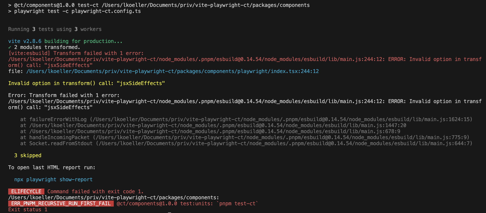

# playwright-ct-vite-reproduction

## Getting started

From the monorepo root directory, run:

```bash
pnpm i
```

Now, run playwright component tests via:

```bash
pnpm --filter "@ct/components" test:units
```

## Error

> Invalid option in transform() call: "jsxSideEffects"

The error appears when adding `"vite": "^2.8.6"` to the `peerDependencies` of `@ct/components`.

